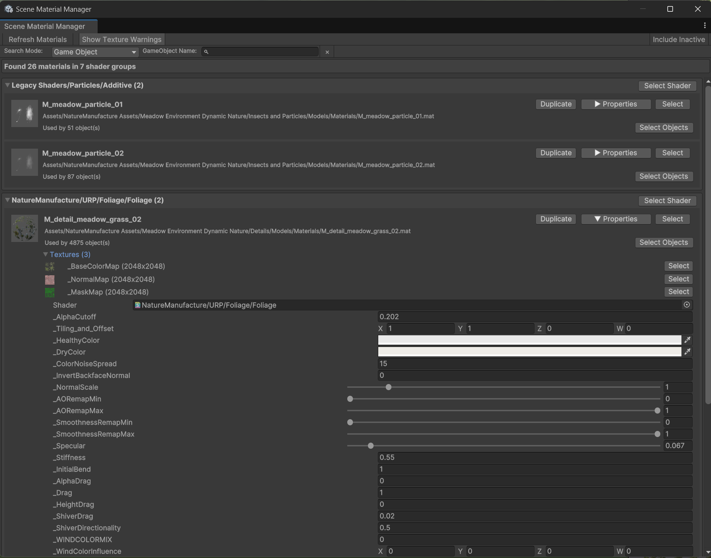

# Scene Material Manager for Unity

A powerful Unity Editor tool for managing and analyzing materials in your scene. This tool is essential for maintaining material organization, performing optimizations, and getting a clear overview of all materials used in your project.

## Features

### Material Overview
- View all materials organized by shader type
- See material previews and properties
- Quick access to material locations in the project
- Edit material properties directly in the tool
- Change shaders for materials with automatic refresh

### Material Usage Analysis
- Track how many objects use each material
- Select all GameObjects using a specific material
- View which GameObjects are using each material
- Filter materials based on GameObject names

### Search and Filter
- Dual search modes:
  - Search by material/shader names
  - Search by GameObject names using the materials
- Include/exclude inactive GameObjects
- Quick material location with project view ping

### Texture Management
- View all textures used in each material
- Texture size and format analysis
- Warning system for large textures (>2048px)
- Quick access to texture assets
- Texture preview thumbnails

### Material Operations
- Quick material duplication with auto-incrementing names
- Modify material properties with full undo support
- Select and ping materials in the Project window
- Select and highlight objects using specific materials

## Installation

1. Copy the `SceneMaterialManager.cs` script into your project's Editor folder
2. Access the tool through Unity's menu: Tools > Roundy > Scene Material Manager

## Usage

### Basic Navigation
- Use the toolbar to refresh materials and toggle inactive object inclusion
- Switch between search modes to find materials by name or by GameObject
- Click the properties button to expand/collapse material details
- Use the texture warnings toggle to identify oversized textures

### Working with Materials
- Click "Select" to highlight the material in the Project window
- Use "Duplicate" to create a copy of the material
- Modify material properties directly in the interface
- Change shaders using the shader selection field
- View and select textures used in materials

### Optimization Workflow
Perfect for optimization passes on your project:
- Identify oversized textures
- Find unused or duplicate materials
- Track material usage across objects
- Organize materials by shader type
- Quick access to all material properties

## Contributing

Feel free to submit issues and pull requests with improvements or bug fixes.

## License

This tool is released under the MIT License. See the LICENSE file for details.
